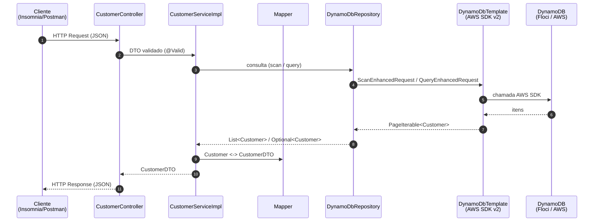

# 🛒 API REST Customer | AWS DynamoDB & Java + Spring Boot

> API REST para gerenciamento de clientes ("customers"), construída com **Java 21 + Spring Boot** e
> persistência em **AWS DynamoDB**. Projeto de estudo focado em boas práticas de back-end: testes
> automatizados, mutation testing, containerização (Floci) e integração com serviços AWS.

<div align="center">

[](https://codecov.io/gh/marcuskeller/dynamodb)
[](https://dashboard.stryker-mutator.io/reports/github.com/marcuskeller/dynamodb/main)

</div>

---

## 📑 Sumário

- [📖 Sobre o Projeto](#-sobre-o-projeto)
- [🏗 Arquitetura](#-arquitetura)
- [🗂 Estrutura de Pastas](#-estrutura-de-pastas)
- [🚀 Tecnologias & Ferramentas](#-tecnologias--ferramentas)
- [💻 Modelagem no DynamoDB](#-modelagem-no-dynamodb)
- [▶️ Como Executar](#️-como-executar)
- [⚙️ Configuração](#️-configuração)
- [📡 Endpoints da API](#-endpoints-da-api)
- [📖 Swagger / OpenAPI](#-swagger--openapi)
- [🧪 Testes](#-testes)
- [🔄 CI/CD](#-cicd)
- [🗺 Roadmap](#-roadmap)
- [✍️ Créditos](#️-créditos)
- [👨‍🚀 Autor](#-autor)

---

## 📖 Sobre o Projeto

API REST de clientes usando **Spring Boot 4** integrado ao **Amazon DynamoDB** (banco NoSQL).
O acesso ao banco é feito pelo `DynamoDbTemplate` da biblioteca **Spring Cloud AWS**
(`io.awspring.cloud:spring-cloud-aws-starter-dynamodb`) sobre o **AWS SDK v2 Enhanced Client** —
não usa Spring Data repositories.

Objetivos de estudo:

- Modelagem de dados não-relacional (NoSQL) com DynamoDB: partition key, GSI e TTL;
- Construção de uma API REST em camadas (Controller → Service → Repository → Model);
- Qualidade de código: testes unitários (JUnit 5 + Mockito), **mutation testing** (Pitest/Stryker)
  e cobertura (JaCoCo/Codecov);
- Ambiente local 100% em contêiner com **Floci** (emulador de AWS open-source, alternativa
  drop-in ao LocalStack — mesma porta `4566`) simulando o DynamoDB da AWS;
- Pipeline de CI/CD no GitHub Actions com versionamento automático (Conventional Commits).

## 🏗 Arquitetura



Camadas:

| Camada | Classe | Responsabilidade |
|---|---|---|
| Controller | `controller/CustomerController` | expõe os endpoints REST, valida a entrada |
| Service | `service/CustomerService` + `service/impl/CustomerServiceImpl` | regra de negócio (duplicidade, existência) |
| Mapper | `mapper/Mapper` | converte `CustomerDTO` ↔ `Customer` e formata datas / calcula o TTL |
| Repository | `repository/DynamoDbRepository` | monta `scan` / `query` no DynamoDB via `DynamoDbTemplate` |
| Model | `model/Customer` | entidade `@DynamoDbBean` (mapeia a tabela `customers`) |
| DTO | `dto/CustomerDTO` | contrato JSON de entrada/saída da API |
| Exceptions | `exceptions/*` | `@ControllerAdvice` traduz exceções em respostas HTTP (404 / 422 / 500) |
| Config | `config/DynamoDBConfiguration`, `config/Constants` | beans de conexão e constantes (fuso, +3 meses, formatador de data) |

## 🗂 Estrutura de Pastas

```
dynamodb/
├── docker-compose.yml            # Floci (emulador AWS: DynamoDB) + dynamodb-admin
├── init/start.d/
│   └── 01-setup-dynamodb.sh      # roda no boot do Floci: cria a tabela, insere dados e liga o TTL
├── files/database/
│   ├── customerTable.json        # definição da tabela "customers" (+ GSI xCompanyName)
│   └── putCustomers.json         # carga inicial (3 clientes)
├── src/main/java/br/com/dynamodb/
│   ├── DynamoDbApplication.java
│   ├── config/        · controller/   · dto/
│   ├── exceptions/    · mapper/       · model/
│   ├── repository/    · service/      · service/impl/
├── src/main/resources/application.properties
├── src/test/java/br/com/dynamodb/    # JUnit 5 + Mockito
└── .github/workflows/pipeline.yml    # CI/CD
```

## 🚀 Tecnologias & Ferramentas

<div align="left">
  
  
  
  
  
  
  
  
</div>

- **Floci** — emulador de AWS local (open-source, MIT), alternativa drop-in ao LocalStack;
  expõe todos os serviços na porta `4566`. Imagem `floci/floci:latest-aws`.
- **Spring Cloud AWS** `4.1.0` — `spring-cloud-aws-starter-dynamodb` (`DynamoDbTemplate`)
- **springdoc-openapi** `3.1.0` — gera OpenAPI 3.1 + Swagger UI (`springdoc-openapi-starter-webmvc-ui`)
- **Lombok** — getters/setters/builder
- **Jakarta Bean Validation** — `@NotNull` / `@NotBlank` no DTO
- **JaCoCo** `0.8.15` — cobertura → Codecov
- **Pitest** `1.25.9` + **Stryker Dashboard** — mutation testing
- **Qodana** (JetBrains) — análise estática no CI
- **standard-version** — CHANGELOG + tag automáticos (Conventional Commits)

## 💻 Modelagem no DynamoDB

Tabela `customers` — partition key `id` (`S`), com um Global Secondary Index `xCompanyName`
sobre `company_name`. Definição em [`files/database/customerTable.json`](files/database/customerTable.json):

```json
{
  "TableName": "customers",
  "AttributeDefinitions": [
    { "AttributeName": "id", "AttributeType": "S" },
    { "AttributeName": "company_name", "AttributeType": "S" }
  ],
  "KeySchema": [
    { "AttributeName": "id", "KeyType": "HASH" }
  ],
  "ProvisionedThroughput": { "ReadCapacityUnits": 5, "WriteCapacityUnits": 5 },
  "GlobalSecondaryIndexes": [
    {
      "IndexName": "xCompanyName",
      "KeySchema": [ { "AttributeName": "company_name", "KeyType": "HASH" } ],
      "Projection": { "ProjectionType": "ALL" },
      "ProvisionedThroughput": { "ReadCapacityUnits": 1, "WriteCapacityUnits": 1 }
    }
  ]
}
```

Atributos do item (nomes no banco em `snake_case`, ver `model/Customer.java`):

| Atributo (DynamoDB) | Tipo | Campo Java | Observação |
|---|---|---|---|
| `id` | S | `id` | partition key, UUID gerado na criação |
| `company_name` | S | `companyName` | chave do GSI `xCompanyName` |
| `company_document_number` | S | `companyDocumentNumber` | usado como chave de negócio (unicidade) |
| `phone_number` | S | `phoneNumber` | |
| `create_date` | S | `createDate` | `LocalDateTime` ISO gravado como texto |
| `updated_date` | S | `updatedDate` | preenchido em update/disable |
| `expiration_date` | N | `expirationDate` | **TTL** — epoch em segundos = `createDate` + 3 meses (`Constants.PLUS_MONTH`) |
| `active` | BOOL | `active` | `false` após `disableCustomer` |

O TTL sobre `expiration_date` é habilitado automaticamente pelo script de init.

## ▶️ Como Executar

### Pré-requisitos

- **Java 21** (o wrapper respeita a variável `JAVA_HOME`)
- **Maven** — **não é obrigatório instalar**; o projeto traz o Maven Wrapper (`mvnw`). Veja a tabela de comandos por sistema logo abaixo.
- **Docker** + **Docker Compose**

### Maven Wrapper (`mvnw`)

**Maven** é a ferramenta que constrói o projeto: baixa as dependências (Spring, AWS SDK...),
compila o código, roda os testes e gera o `.jar`. A "receita" do que baixar e como construir
está no arquivo `pom.xml`.

Você **não precisa instalar** o Maven. O projeto traz o *wrapper* (`mvnw` / `mvnw.cmd`) — um
script que, na 1ª execução, baixa a versão certa do Maven sozinho.

| Quero... | Linux / macOS | Windows (PowerShell) |
|---|---|---|
| Build completo (compila + testa + empacota) | `./mvnw clean verify` | `.\mvnw.cmd clean verify` |
| Só rodar os testes | `./mvnw test` | `.\mvnw.cmd test` |
| Subir a aplicação | `./mvnw spring-boot:run` | `.\mvnw.cmd spring-boot:run` |
| Rodar o `.jar` já gerado | `java -jar target/dynamodb-0.1.0.jar` | `java -jar target\dynamodb-0.1.0.jar` |

> Linux/macOS, se der `Permission denied`: `chmod +x mvnw` uma vez.

### Passo a passo

```bash
# 1. Clonar
git clone https://github.com/marcuskeller/dynamodb.git
cd dynamodb

# 2. Subir o DynamoDB local (Floci) + a UI dynamodb-admin
#    O script init/start.d/01-setup-dynamodb.sh roda no boot e já:
#      - cria a tabela "customers" (com o GSI xCompanyName)
#      - insere 3 clientes de exemplo (files/database/putCustomers.json)
#      - habilita o TTL em "expiration_date"
docker compose up -d

# 3. Conferir (opcional): UI web das tabelas
#    http://localhost:8001

# 4. Compilar, rodar os testes e empacotar
./mvnw clean verify

# 5. Iniciar a aplicação
./mvnw spring-boot:run
```

- API: **http://localhost:9595**
- Swagger UI: **http://localhost:9595/swagger-ui/index.html**
- DynamoDB (Floci): **http://localhost:4566**
- dynamodb-admin (UI): **http://localhost:8001**

> **Nota:** rode o `docker compose up -d` **na pasta que contém o `docker-compose.yml`**
> (a raiz do projeto). O contêiner `floci` executa sozinho o `init/start.d/01-setup-dynamodb.sh`,
> então a tabela `customers`, a carga inicial e o TTL já ficam prontos — não é preciso criar nada à mão.
>
> Alternativa sem Docker Compose: `docker run -p 4566:4566 floci/floci:latest-aws` e, em seguida,
> criar a tabela manualmente
> (`aws dynamodb create-table --endpoint-url http://localhost:4566 --region sa-east-1 --cli-input-json file://files/database/customerTable.json`)
> e habilitar o TTL.

## ⚙️ Configuração

Definido em `src/main/resources/application.properties` (valores default para ambiente local):

| Propriedade | Default | Descrição |
|---|---|---|
| `server.port` | `9595` | porta HTTP da API |
| `aws.dynamodb.endpoint` | `http://localhost:4566` | endpoint do DynamoDB (Floci) |
| `aws.dynamodb.accessKey` / `aws.dynamodb.secretKey` | `test` / `test` | credenciais fake para o Floci |
| `aws.region` | `sa-east-1` | região AWS |
| `aws.profile` | `localstack` | nome do profile de credenciais (herdado do LocalStack; hoje aponta para o Floci) |
| `spring.profiles.active` | `localstack` | profile Spring ativo (mesma observação acima) |
| `spring.cloud.aws.dynamodb.table-name-overrides[0].entity-class-name` | `br.com.dynamodb.model.Customer` | entidade a mapear |
| `spring.cloud.aws.dynamodb.table-name-overrides[0].table-name` | `customers` | nome da tabela no DynamoDB |

## 📡 Endpoints da API

Base: `http://localhost:9595/v1`

| Método | Rota | Parâmetros | Descrição | Erros |
|---|---|---|---|---|
| `POST`  | `/v1/customer` | body: `{ "companyName", "companyDocumentNumber", "phoneNumber" }` | Cria um cliente (gera `id`, `createDate`, `expirationDate`, `active=true`) | `422` se já existir cliente com o mesmo `companyDocumentNumber` |
| `GET`   | `/v1/customer?companyName={nome}` | query `companyName` | Lista clientes pelo nome (**scan** + filtro) | — |
| `GET`   | `/v1/customer/query?companyName={nome}` | query `companyName` | Busca **1** cliente pelo GSI `xCompanyName` (**query**) | `404` se não encontrar |
| `GET`   | `/v1/customer/all` | — | Lista todos os clientes (**scanAll**) | — |
| `PATCH` | `/v1/customer` | body: `CustomerDTO` (com `companyDocumentNumber`) | Atualiza `companyName` / `phoneNumber` e grava `updatedDate` | `404` se não existir |
| `PATCH` | `/v1/customer/{companyDocumentNumber}` | path `companyDocumentNumber` | Desativa o cliente (`active=false`) | `404` se não existir |

Exemplo — criar cliente:

```bash
curl -X POST http://localhost:9595/v1/customer \
  -H "Content-Type: application/json" \
  -d '{
        "companyName": "Empresa Brasileira LTDA",
        "companyDocumentNumber": "12345678000199",
        "phoneNumber": "11-99999-0000"
      }'
```

Resposta (`200 OK`):

```json
{
  "companyName": "Empresa Brasileira LTDA",
  "companyDocumentNumber": "12345678000199",
  "phoneNumber": "11-99999-0000",
  "createDate": "03/09/2026 10:15:42",
  "expirationDate": "03/12/2026 10:15:42",
  "active": true
}
```

Formato de erro (`exceptions/ExceptionResponse`):

```json
{
  "timestamp": "2026-09-03T13:15:42.000+00:00",
  "message": "There is already a customer with this document number",
  "details": "uri=/v1/customer"
}
```

## 📖 Swagger / OpenAPI

A documentação interativa é gerada automaticamente pelo **springdoc-openapi** a partir das
anotações do `CustomerController` — não há arquivo de spec para manter à mão.

Com a aplicação rodando (`./mvnw spring-boot:run`):

| Recurso | URL |
|---|---|
| **Swagger UI** (interface: expandir endpoint → *Try it out* → *Execute*) | http://localhost:9595/swagger-ui/index.html |
| **OpenAPI 3.1 em JSON** (consumido pelo Swagger UI; importável no Postman/Insomnia) | http://localhost:9595/v3/api-docs |
| OpenAPI em YAML | http://localhost:9595/v3/api-docs.yaml |

Dependência (em `pom.xml`):

```xml
<dependency>
    <groupId>org.springdoc</groupId>
    <artifactId>springdoc-openapi-starter-webmvc-ui</artifactId>
    <version>${springdoc.version}</version> <!-- 3.1.0 — suporte a Spring Boot 4.1.x -->
</dependency>
```

> Para enriquecer a doc (descrições, exemplos, agrupamento), anotar os métodos/DTOs com
> `@Operation`, `@Parameter`, `@Schema`, `@Tag` (pacote `io.swagger.v3.oas.annotations`). Opcional.

## 🧪 Testes

- **JUnit 5** + **Mockito** — testes unitários das camadas (controller, service, mapper, repository, exceptions, config). São os 13 arquivos `*Test.java` (77 testes).
- **JaCoCo** — relatório de cobertura em `target/site/jacoco/` (enviado ao Codecov no CI).
- **Pitest / Stryker** — mutation testing (garante que os testes realmente falham quando o código muda).

```bash
# Testes unitários + cobertura
./mvnw clean test

# Relatório JaCoCo (HTML/XML)
./mvnw jacoco:report        # abre target/site/jacoco/index.html

# Mutation testing
./mvnw test-compile org.pitest:pitest-maven:mutationCoverage
```

## 🔄 CI/CD

Workflow: [`.github/workflows/pipeline.yml`](.github/workflows/pipeline.yml). Dispara em push nas branches
`feature/**`, `develop`, `main` e em PRs para `develop` / `main`.

1. **Tests & Analysis** — `mvn test`, relatório JaCoCo, Pitest (Stryker Dashboard), upload Codecov, scan Qodana.
2. **Create Pull Requests** (só em push) — abre PR automático `feature/** → develop` e `develop → main`.
3. **Release & Tag** (só em push na `main`) — `standard-version` incrementa a versão, gera o `CHANGELOG.md`,
   cria a tag e a GitHub Release, seguindo **Conventional Commits** (`feat:` → minor, `fix:` → patch,
   `BREAKING CHANGE` → major).

## 🗺 Roadmap

- [x] Pipeline de CI/CD no GitHub Actions com release automático
- [x] Documentação da API com Swagger / OpenAPI (springdoc-openapi)
- [ ] Endpoints `GET /v1/customer/{id}` e `DELETE /v1/customer/{id}`
- [ ] Deploy em ambiente AWS real (Lambda + API Gateway ou ECS)
- [ ] Perfis Spring separados (`local` / `aws`) para credenciais reais

## ✍️ Créditos

Projeto baseado no material publicado por **Kaike Ventura**.
[](https://www.linkedin.com/in/kaike-ventura-185695aa/)

Aplicação original criada por **Flavio Monteiro**.

**Marcus Keller** entrou no desafio e está ajudando a evoluir a aplicação (correções, testes, documentação e este fork).

---

## 👨‍🚀 Autor

Feito por **Flavio Monteiro** 👋

<a target="_blank" href="mailto:flaviohnm@gmail.com"></a>
<a target="_blank" href="https://www.linkedin.com/in/flaviohnm/"></a>
<a href="https://buymeacoffee.com/flaviohnm" title="buy me a coffee" target="_blank"></a>
